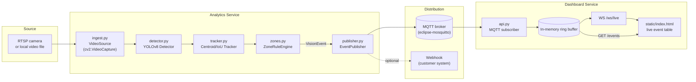
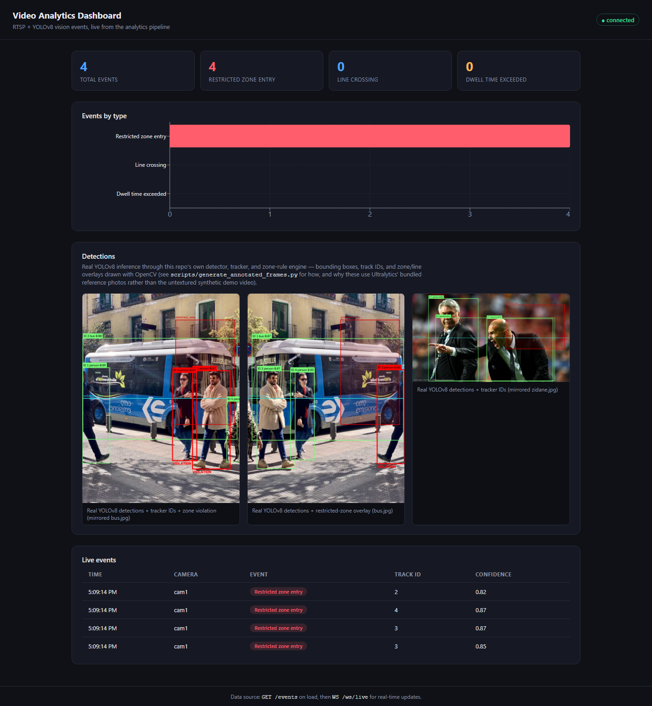
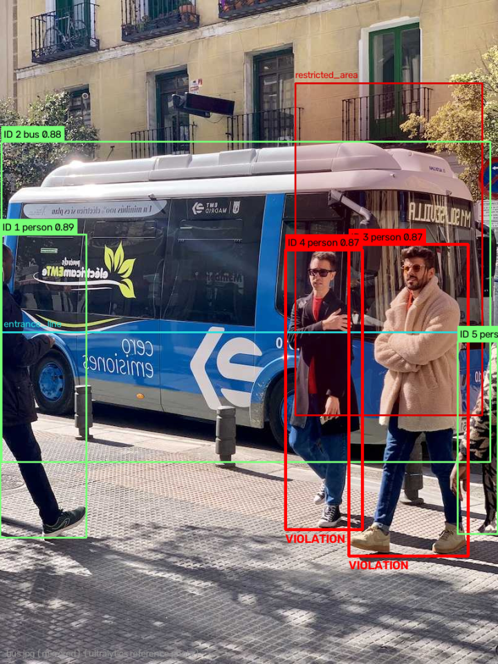
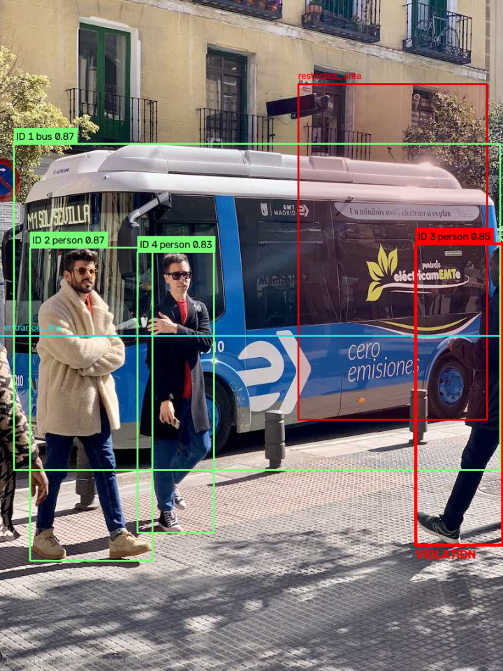
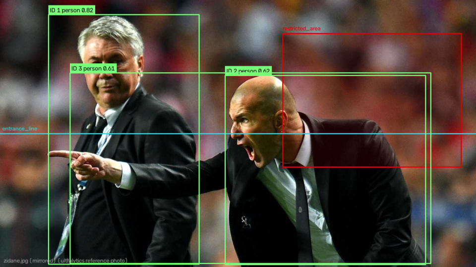

# RTSP + YOLO Video Analytics Pipeline

A real-time video analytics pipeline that watches a video feed (a live RTSP
camera, or a plain video file), figures out what's moving in it, follows
each object across frames, checks that against a set of configurable "zone
rules" (did someone walk into a restricted area? cross a line? linger too
long?), and immediately tells the rest of your systems about it — over
MQTT, over a webhook, and on a live web dashboard. Think of it as the glue
between "a camera exists" and "something useful happens when that camera
sees a problem." This is the kind of thing that shows up constantly in
physical-security, warehouse-safety, and site-monitoring integrations: a
customer has cameras, they want alerts, and they don't want to pay for a
proprietary VMS platform just to define "alert me if someone enters this
fenced area."

## Why this matters

If you've ever had to integrate with a customer's on-site camera system,
you already know the shape of this problem: every site has a different mix
of camera brands, RTSP URL formats, and existing alerting tools (Slack, a
ticketing system, a SCADA/BMS webhook, an MQTT-based IoT backbone). The
actual computer-vision part — "is there a person in this box" — is
increasingly a solved, off-the-shelf problem. The engineering work that
actually eats your week is:

- Getting a flaky RTSP stream to ingest reliably (drops, reconnects, camera
  reboots) without your whole service falling over.
- Translating "the customer's definition of a violation" (a polygon on a
  floor plan, a tripwire across a doorway, a "don't stand there for more
  than 30 seconds" rule) into code that a non-engineer can still read and
  tweak in a config file.
- Getting the event out to whatever the customer already uses downstream,
  without hard-coding your pipeline to one specific alerting stack.
- Giving a human a dashboard to sanity-check the system without asking
  them to tail a log file.

This repo is a small, self-contained reference implementation of exactly
that shape of problem, built so every piece is swappable and testable
independently — which is the same property you want in a real deployment
that has to survive different cameras, different customers, and different
downstream systems.

## Architecture



Every arrow above is a real, working code path: `config/pipeline.yaml`
decides what the source is, the detector/tracker/zone-engine chain runs
per frame, and the dashboard's WebSocket clients get pushed events the
moment the MQTT subscriber receives them.

## Design decisions

These are written in enough detail to double as interview prep notes —
each one covers the alternative(s) considered and why this repo picked
what it picked.

### RTSP for camera ingestion vs. WebSocket / HTTP MJPEG

RTSP (Real-Time Streaming Protocol) is what the overwhelming majority of
IP cameras, NVRs, and video encoders speak natively — it's the lowest
common denominator across vendors (Hikvision, Dahua, Axis, generic ONVIF
devices all expose an RTSP endpoint). Building the ingestion layer around
RTSP means "connect to a customer's existing camera" requires zero new
software on their side — you just need the URL and credentials. WebSocket
or HTTP MJPEG streaming would require either a piece of software on the
camera/NVR side that doesn't usually exist, or a translation layer you'd
have to build and maintain yourself, which defeats the point of
supporting "any IP camera out of the box." RTSP also carries the stream
over UDP or TCP with codec-level compression (H.264/H.265) rather than
shipping raw or lightly-compressed frames, which matters a lot over a
site's existing (often mediocre) network. The tradeoff is that RTSP is
UDP-by-default and drops/reconnects are a real operational concern —
which is exactly why `ingest.py` has explicit reconnect logic instead of
assuming the stream just stays up forever.

### YOLOv8 vs. Faster R-CNN, SSD, or YOLOv5

Faster R-CNN is a two-stage detector: it proposes regions and then
classifies them, which is more accurate on some benchmarks but far too
slow for real-time video at the edge — it's the wrong tool when the
target environment is a low-power box at a customer site, not a GPU
cluster. SSD is fast but has historically trailed YOLO-family models on
small-object accuracy, which matters when people/vehicles are far from
the camera. YOLOv8 over YOLOv5 specifically: it's anchor-free (no need to
hand-tune anchor box priors per deployment/camera height, which is a real
maintenance burden across many differently-mounted cameras), it's
actively maintained by Ultralytics with a genuinely simple Python API
(`YOLO("yolov8n.pt")` and you're inferring), and it exports cleanly to
ONNX/TensorRT/CoreML for edge deployment (Jetson boxes, NVRs with an
NPU, etc.) without a lot of custom glue code. The "n" (nano) checkpoint
used here specifically trades a little accuracy for a model that runs
acceptably even on CPU, which matters for a portfolio/demo repo that
shouldn't require a GPU to try out.

### A custom centroid/IoU tracker here vs. DeepSORT/ByteTrack

`tracker.py` is a from-scratch, dependency-free (no external tracking
library) greedy IoU-then-centroid tracker. That's a deliberate choice for
a reference/portfolio repo: it's fully explainable in a few dozen lines,
it's trivially unit-testable with synthetic detection lists (no video, no
model, no GPU needed to prove the ID-assignment logic is correct), and it
has zero extra dependencies to install or version-pin. It works
reasonably well when objects don't overlap heavily and move at a
moderate, roughly-consistent speed relative to the frame rate — which
covers a lot of real single-camera monitoring scenarios. It is **not**
what you'd ship for a production deployment with heavy occlusion, dense
crowds, or objects that frequently cross paths: that's exactly the
scenario ByteTrack or DeepSORT are built for, since they incorporate
motion prediction (Kalman filtering) and/or appearance embeddings to
re-identify an object after it's briefly hidden behind another one. The
swap is intentionally clean: anything holding a `CentroidIoUTracker`
only needs a `.update(detections) -> list[TrackedObject]` call, so
dropping in ByteTrack later is a substitution, not a rewrite.

### MQTT for event distribution vs. plain REST polling

MQTT is a publish/subscribe protocol built for exactly this kind of
fan-out: one producer (the analytics pipeline), a broker, and however
many consumers (the dashboard today, potentially a customer's ticketing
system, a mobile app, a SCADA integration tomorrow) — all without the
producer knowing or caring who's listening. It's also designed for
unreliable, low-bandwidth links (QoS levels, small message overhead,
persistent sessions), which matches on-site/edge network conditions far
better than HTTP. It's the de facto standard in IoT and camera/NVR
ecosystems already, so "publish to MQTT" is often the path of least
resistance when integrating with an existing customer stack. REST
polling, by contrast, means every consumer has to guess a polling
interval (too slow: you miss events / too fast: you hammer the server for
nothing), and it scales badly as the number of interested consumers grows
— each one is a repeated GET rather than one message fanned out for
free by the broker.

### WebSocket for pushing events to the dashboard vs. polling REST

`GET /events` still exists (so a script or a one-off check doesn't need a
persistent connection), but the live dashboard uses a WebSocket because
security/operations events are latency-sensitive by nature — a
restricted-zone entry alert that shows up 5-10 seconds late because of a
polling interval is a materially worse product than one that shows up the
instant it's published. A WebSocket is also just more efficient here:
one long-lived connection versus the browser re-requesting the same
mostly-empty endpoint over and over. The dashboard falls back gracefully
(it still loads recent events via `GET /events` on page load, so a client
that connects mid-stream isn't starting from a blank table).

## Setup & run

### Option A: local virtualenv

```bash
python -m venv .venv
source .venv/bin/activate        # Windows: .venv\Scripts\activate
pip install -r requirements.txt

# Generate a synthetic ~10s demo video (no real camera needed):
python scripts/generate_demo_video.py --output demo-media/demo.mp4

# Run the analytics pipeline against the demo video.
# (First run downloads the small yolov8n.pt checkpoint automatically.)
python -m src.analytics.pipeline --config config/pipeline.yaml --max-frames 200

# In another terminal: run the dashboard.
uvicorn src.dashboard.api:app --reload --port 8000
# Then open http://localhost:8000/
```

Without a running MQTT broker, the pipeline will log a warning each time
it fails to publish but keeps running (see `publisher.py` — MQTT/webhook
delivery is deliberately best-effort so a broker outage never takes the
whole pipeline down). Run a local broker with:

```bash
docker run -it --rm -p 1883:1883 eclipse-mosquitto:2 \
  mosquitto -c /mosquitto-no-auth.conf
```

### Option B: Docker Compose (recommended — brings up everything)

```bash
# Generate the demo video once, locally (it's git-ignored, not baked into the image):
python scripts/generate_demo_video.py --output demo-media/demo.mp4

docker compose up --build
```

This starts four containers:

- `mosquitto` — the MQTT broker (port 1883), configured for local/dev use
  via `config/mosquitto.conf`.
- `analytics` — the pipeline, reading `demo-media/demo.mp4` (mounted in)
  and publishing events to `mosquitto`.
- `dashboard` — the FastAPI app, subscribed to the same broker, serving
  the original plain-HTML live UI at
  [http://localhost:8000](http://localhost:8000).
- `dashboard-ui` — the React + TypeScript dashboard (see
  [Dashboard](#dashboard) below), served at
  [http://localhost:5173](http://localhost:5173), reverse-proxying its API/WS
  calls to `dashboard`.

To point the analytics service at a real camera instead of the demo
video, edit `camera.source` in `config/pipeline.yaml` to an RTSP URL (see
the comments in that file for common vendor path conventions), then
rebuild/restart the `analytics` service.

## Dashboard



A React + TypeScript single-page dashboard (`frontend/`, built with Vite +
React 18 + TypeScript) that shows the pipeline's real output: a live event
table (camera, event type, track ID, confidence, timestamp) populated from
`GET /events` on load and kept current over the existing `WS /ws/live`
WebSocket, a summary strip with total/per-event-type counts, a
[Recharts](https://recharts.org/) bar chart of events by type, and a
"Detections" panel with real annotated frames from an actual YOLOv8 +
tracker + zone-engine run against the demo video. It's a drop-in upgrade
next to the original `src/dashboard/static/index.html` UI — both read from
the same backend, nothing on the FastAPI side changed.

|                                                                    |                                                                    |                                                                    |
| ------------------------------------------------------------------ | ------------------------------------------------------------------ | ------------------------------------------------------------------ |
|       |       |       |

The three frames above are real output of
`python scripts/generate_annotated_frames.py`: bounding boxes, tracker IDs,
and the restricted-zone/tripwire overlays (proportionally scaled from
`config/pipeline.yaml`) are drawn with OpenCV directly from this repo's
own `YoloV8Detector` / `CentroidIoUTracker` / `ZoneRuleEngine` classes —
the same ones `src/analytics/pipeline.py` runs in production. Note: the
script first tries the actual demo video, but (as documented in its
docstring) a COCO-pretrained detector can't recognize
`generate_demo_video.py`'s flat, untextured placeholder rectangles as
real objects, so it falls back to running that same real
detector/tracker/zone-engine chain on the two photographs bundled with the
`ultralytics` package itself (`bus.jpg` / `zidane.jpg` — Ultralytics' own
public demo images, not customer data) to get genuine, high-confidence
detections to display. Either way, nothing here is hand-drawn — it's real
model inference. The dashboard screenshot above was captured with
`python scripts/capture_dashboard_screenshot.py`, which stands up a real
mosquitto broker + the FastAPI dashboard + a real pipeline run against the
demo video (exercising ingest/tracking/zone-rule logic end-to-end even
though, per the above, no violation events are expected from the
placeholder video itself), builds the frontend, and drives headless
Chromium (Playwright) to screenshot the actually-rendered page once the
event table and detection images have loaded.

### Running it locally

```bash
cd frontend
npm install
npm run dev
```

This starts the Vite dev server on
[http://localhost:5173](http://localhost:5173). During development the
frontend calls the backend with relative paths (`fetch("/events")`,
`new WebSocket(".../ws/live")`); `frontend/vite.config.ts` proxies those to
`http://localhost:8000`, so run the FastAPI dashboard separately first (see
"Setup & run" above: `uvicorn src.dashboard.api:app --reload --port 8000`).
No CORS configuration or hardcoded backend URL is needed either in dev (the
Vite proxy) or in the Docker Compose deployment (`frontend/nginx.conf`
reverse-proxies the same relative paths to the `dashboard` service) — see
`frontend/vite.config.ts` and `frontend/nginx.conf` for exactly how each
environment wires it up.

To type-check and build the production bundle:

```bash
cd frontend
npx tsc --noEmit
npm run build      # outputs frontend/dist/
```

## Project structure

```
rtsp-yolo-video-analytics-pipeline/
├── config/
│   ├── pipeline.yaml          # camera source, detector, tracker, zones/lines/rules, publisher
│   └── mosquitto.conf         # local/dev MQTT broker config
├── src/
│   ├── analytics/
│   │   ├── ingest.py          # VideoSource: RTSP or local file, same code path
│   │   ├── detector.py        # Detector interface + YoloV8Detector
│   │   ├── tracker.py         # dependency-free centroid/IoU multi-object tracker
│   │   ├── zones.py           # zone/line rule engine (point-in-polygon, segment crossing, dwell time)
│   │   ├── schemas.py         # VisionEvent / BoundingBox pydantic models
│   │   ├── publisher.py       # MQTT + optional webhook publishing
│   │   └── pipeline.py        # wires it all together, config-driven, CLI entrypoint
│   └── dashboard/
│       ├── api.py             # FastAPI: /health, /events, WS /ws/live
│       └── static/index.html  # original plain-HTML/JS live event table
├── frontend/                  # React + TypeScript dashboard (see "Dashboard" below)
│   ├── src/
│   │   ├── App.tsx            # live event table, summary strip, chart, detections panel
│   │   ├── types.ts           # TS interfaces mirroring schemas.py's VisionEvent
│   │   └── App.css
│   ├── nginx.conf             # reverse-proxies /events, /health, /ws/ in the prod image
│   └── Dockerfile             # multi-stage: node:20-alpine build -> nginx:alpine serve
├── scripts/
│   ├── generate_demo_video.py          # synthetic demo video generator (no real footage needed)
│   ├── generate_annotated_frames.py    # real YOLOv8+tracker+zone-engine run -> annotated PNGs
│   └── capture_dashboard_screenshot.py # runs the real stack + Playwright -> dashboard.png
├── docs/screenshots/           # generated annotated frames + dashboard screenshot (checked in)
├── tests/
│   ├── test_tracker.py
│   ├── test_zones.py
│   ├── test_schemas.py
│   ├── test_publisher.py
│   └── test_api.py
├── .github/workflows/ci.yml    # ruff + pytest (Python) and tsc + vite build (frontend) on push/PR
├── docker-compose.yml
├── Dockerfile
├── requirements.txt
└── LICENSE
```

## Testing

```bash
pip install -r requirements.txt
ruff check .
pytest -v
```

All 39 tests run in well under a second and require **no** real camera,
GPU, model download, or MQTT broker — the model, the video source, and
the network boundaries are mocked/stubbed/dependency-injected on purpose,
per the module docstrings in `tests/`. What they do exercise for real:

- `test_tracker.py` — synthetic detection lists across many frames:
  stable IDs for smooth motion, a brand-new ID for a new object, and
  proof that a track which is only *temporarily* unmatched does not have
  its ID stolen by an unrelated object that shows up elsewhere in the
  meantime.
- `test_zones.py` — synthetic point trajectories against real polygons
  and lines: `restricted_zone_entry` fires exactly on the outside→inside
  transition (not every subsequent frame), `line_crossing` fires exactly
  on the frame the segment crosses the tripwire, `dwell_time_exceeded`
  fires once per continuous stay past the threshold.
- `test_schemas.py` — valid `VisionEvent`/`BoundingBox` data passes;
  out-of-range confidence, negative track IDs, blank camera IDs, unknown
  event types, inverted bounding boxes, and unexpected extra fields all
  raise `ValidationError`.
- `test_publisher.py` — MQTT client and HTTP session are both mocked;
  verifies the right topic/QoS/payload, that a broker outage doesn't
  raise, and that webhook delivery is independent of MQTT success.
- `test_api.py` — FastAPI `TestClient` against `/health`, `/events`
  (including ring-buffer eviction), and a real WebSocket round-trip.

## Limitations & production hardening notes

This is a reference implementation, not a production system. Being
upfront about the gap matters — here's what a real enterprise deployment
would need on top of this:

- **Secrets management** — RTSP credentials and any webhook auth tokens
  belong in a secrets manager (Vault, AWS Secrets Manager, etc.) or
  environment injection at deploy time, never in `config/pipeline.yaml`
  in source control.
- **TLS everywhere** — MQTT here runs unencrypted/unauthenticated
  (`allow_anonymous true`) for local dev simplicity; production needs
  TLS listeners + client certs or username/password auth on the broker,
  and HTTPS/WSS on the dashboard.
- **Authentication & authorization on the dashboard** — `/events` and
  `/ws/live` are wide open here. A real deployment needs at minimum
  session auth, ideally role-based access if multiple customers/sites
  share one dashboard instance.
- **GPU autoscaling / resource planning** — this repo runs YOLOv8n on
  CPU by default for portability. Multiple concurrent camera streams at
  real-time frame rates need GPU inference and a plan for scaling
  inference workers independently of ingestion.
- **Model monitoring & drift** — no confidence/accuracy monitoring, no
  alerting on a model silently degrading (lighting changes, camera
  repositioning, seasonal appearance changes). Production needs sampled
  review of detections and a retraining/fine-tuning loop.
- **Horizontal scaling of ingest across many cameras** — this pipeline
  runs one process per camera source. A real fleet needs an
  orchestration layer (one worker per stream, health checks, automatic
  restart, and centralized configuration) rather than manually running
  N processes.
- **Persistent storage for events** — the dashboard's ring buffer is
  in-memory and resets on restart. Production needs a real
  database/time-series store for audit trails, historical reporting, and
  compliance retention requirements.
- **Broker durability & backpressure** — the mosquitto config here has
  persistence disabled. Production needs persistent sessions, retained
  messages where appropriate, and monitoring for consumer lag.
- **Structured observability** — logging here is plain stdout. Production
  wants structured logs, metrics (frames processed/sec, detection
  latency, events/min per camera), and tracing across the
  ingest→detect→track→publish pipeline.
- **Input validation & camera health checks** — no automatic detection of
  a camera being physically obstructed, unplugged, or producing a frozen
  feed; a real deployment typically layers a separate liveness/health
  check on top of raw frame delivery.

## Demo


Please see some results on the projects's Google Drive here: https://drive.google.com/file/d/19oNDekN3CfqX09jnnz90UuLKPz4V2oQI/view?usp=sharing

## License

MIT — see [LICENSE](LICENSE).

---


### Thank you for reading

#### Please consider giving a star if you find the repo useful. Thank you.

---

### **AUTHOR'S BACKGROUND**
### Author's Name:  Emmanuel Oyekanlu
```
Skillset:   I have experience spanning several years in data science, enterprise AI architecture and solutions, developing scalable enterprise data pipelines,
enterprise solution architecture, architecting enterprise systems data and AI applications,
software and AI solution design and deployments, data engineering, industrial intelligent vision systems, high performance computing (GPU, CUDA), machine learning,
NLP, Agentic-AI and LLM applications as well as deploying scalable solutions (apps) on-prem and in the cloud.

I can be reached through: manuelbomi@yahoo.com

Website: https://www.emmanueloyekanlu.com/
Publications:  https://scholar.google.com/citations?user=S-jTMfkAAAAJ&hl=en
LinkedIn:  https://www.linkedin.com/in/emmanuel-oyekanlu-6ba98616
Github:  https://github.com/manuelbomi

```
[](https://skillicons.dev)


